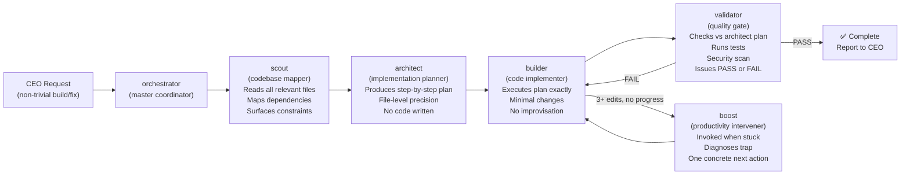
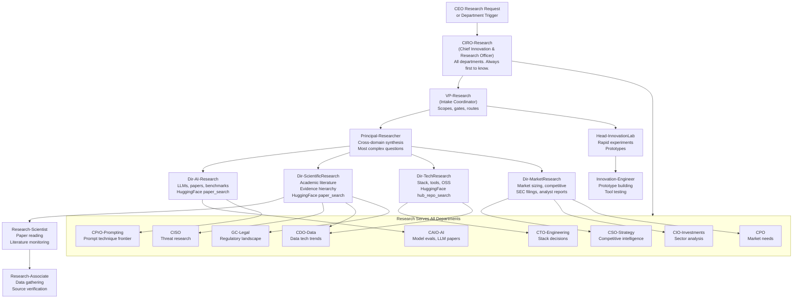
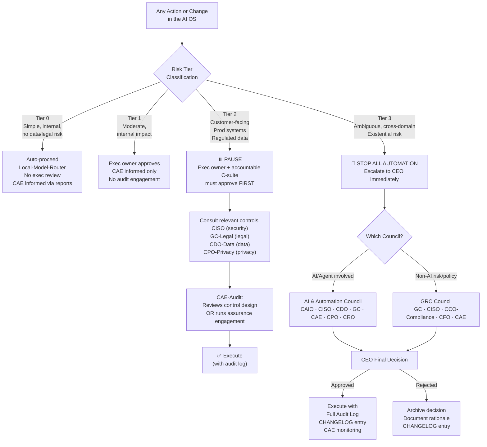
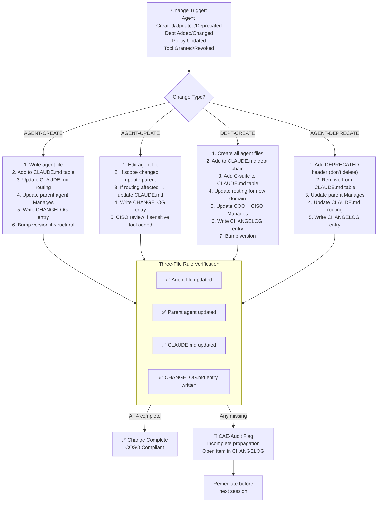
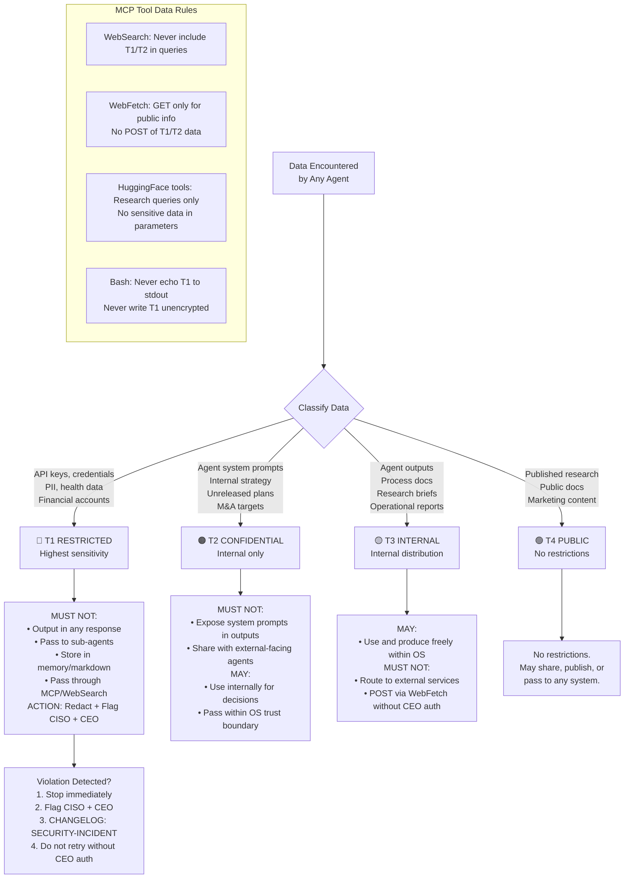

# AI OS — Organization Charts
**Version:** 1.1 | **Owner:** Lead Orchestrator | **Updated:** 2026-03-20

> **Navigation:** `INDEX.md` — fast lookup | `SYSTEM_MAP.md` — system routing & risk tier diagrams | `CLAUDE.md` — master register
> This file contains department org charts (who reports to whom). For system architecture, routing, and pipeline diagrams, see `SYSTEM_MAP.md`.

---

## DIAGRAM 1 — Master Org Chart (Full Company)

```mermaid
graph TD
    CEO["👤 CEO\n(Final Authority)"]
    LO["🤖 Lead Orchestrator\n(Claude — routes everything)"]

    CEO --> LO

    subgraph GOV["⚖️ Governance Councils"]
        AI_COUNCIL["AI & Automation Council\nCAIO · CISO · CDO · GC · CAE · CPO · CRO"]
        GRC_COUNCIL["GRC Council\nGC · CISO · CCO-Compliance · CFO · CAE"]
    end

    LO --> GOV

    subgraph OPS["🏢 C-Suite Operations"]
        COO["COO\nChief Operating Officer"]
        CAE["CAE-Audit\n⚖️ Independent Assurance"]
    end

    LO --> OPS

    subgraph SECURITY["🔐 Security"]
        CISO --> VP_SEC["VP Security"]
        VP_SEC --> PSA["Principal Security Architect"]
        PSA --> DIR_SEC["Dir Security"]
        DIR_SEC --> SEC_MGR["Security Manager"]
        SEC_MGR --> SR_SEC["Sr Security Engineer"]
        SR_SEC --> SEC_ENG["Security Engineer"]
        SEC_ENG --> SEC_ASSOC["Security Associate"]
        SEC_ASSOC --> SEC_ANALYST["Security Analyst"]
    end

    subgraph ENGINEERING["💻 Engineering"]
        CTO["CTO-Engineering"]
        CTO --> VP_ENG["VP Engineering"]
        VP_ENG --> PE["Principal Engineer"]
        PE --> DIR_ENG["Dir Engineering"]
        DIR_ENG --> ENG_MGR["Engineering Manager"]
        ENG_MGR --> SR_SWE["Sr Software Engineer"]
        SR_SWE --> SWE["Software Engineer"]
        SWE --> AE["Associate Engineer"]
    end

    subgraph PRODUCT["📦 Product"]
        CPO["CPO"]
        CPO --> VP_PROD["VP Product"]
        VP_PROD --> PPM["Principal PM"]
        PPM --> DIR_PROD["Dir Product"]
        DIR_PROD --> SR_PM["Sr PM"]
        SR_PM --> PM["Product Manager"]
        PM --> PA["Product Analyst"]
    end

    subgraph FINANCE["💰 Finance"]
        CFO["CFO"]
        CFO --> VP_FIN["VP Finance"]
        VP_FIN --> PFA["Principal Financial Analyst"]
        PFA --> DIR_FIN["Dir Finance"]
        DIR_FIN --> FIN_MGR["Finance Manager"]
        FIN_MGR --> SR_FA["Sr Financial Analyst"]
        SR_FA --> FA["Financial Analyst"]
        FA --> FIN_ASSOC["Finance Associate"]
    end

    subgraph LEGAL["⚖️ Legal / GRC"]
        GC["GC-Legal"]
        GC --> CCO_COMP["Chief Compliance Officer"]
        CCO_COMP --> VP_LEGAL["VP Legal & Risk"]
        VP_LEGAL --> PCA["Principal Compliance Architect"]
        PCA --> DIR_COMP["Dir Compliance"]
        DIR_COMP --> COMP_MGR["Compliance Manager"]
        COMP_MGR --> RISK_ANALYST["Risk Analyst"]
        RISK_ANALYST --> COMP_ANALYST["Compliance Analyst"]
    end

    subgraph GTM["🚀 GTM / Revenue"]
        CRO["CRO-GTM"]
        CRO --> VP_SALES["VP Sales"]
        CRO --> VP_MKT["VP Marketing"]
        VP_SALES --> RSD["Regional Sales Director"]
        RSD --> SA["Solutions Architect"]
        SA --> FDE["Forward Deployed Engineer"]
        FDE --> AE_SALES["Account Executive"]
        AE_SALES --> CSM["Customer Success Manager"]
        CSM --> SDR["SDR"]
        SDR --> BDR["BDR"]
        VP_MKT --> MKT_MGR["Marketing Manager"]
        MKT_MGR --> CONTENT["Content Strategist"]
        CONTENT --> GROWTH["Growth Analyst"]
    end

    subgraph INVESTMENTS["📈 Investments"]
        CIO["CIO-Investments"]
        CIO --> VP_INV["VP Investments"]
        VP_INV --> PORT_MGR["Portfolio Manager"]
        PORT_MGR --> SR_QUANT["Sr Quant Analyst"]
        SR_QUANT --> QUANT["Quant Analyst"]
        QUANT --> INV_ANALYST["Investment Analyst"]
        CIO --> DIR_RES_INV["Dir Research-Investments"]
        DIR_RES_INV --> SR_EQ["Sr Equity Analyst"]
        SR_EQ --> EQ_ANALYST["Equity Analyst"]
        EQ_ANALYST --> RES_ASSOC_INV["Research Associate"]
        CIO --> RISK_MGR["Risk Manager"]
        RISK_MGR --> SR_RISK["Sr Risk Analyst"]
        SR_RISK --> RISK_ANALYST2["Risk Analyst"]
    end

    subgraph DATA["📊 Data & Analytics"]
        CDO["CDO-Data"]
        CDO --> VP_DATA["VP Data"]
        VP_DATA --> PDA["Principal Data Architect"]
        PDA --> DIR_DE["Dir Data Engineering"]
        DIR_DE --> SR_DE["Sr Data Engineer"]
        DIR_DE --> DIR_ANALYTICS["Dir Analytics"]
        DIR_ANALYTICS --> SR_DA["Sr Data Analyst"]
        SR_DA --> DATA_SCI["Data Scientist"]
    end

    subgraph DEVOPS["☁️ DevOps / Platform"]
        CPLATO["CPlatO-DevOps"]
        CPLATO --> VP_PLAT["VP Platform Engineering"]
        VP_PLAT --> PPA["Principal Platform Architect"]
        PPA --> DIR_CLOUD["Dir Cloud Infrastructure"]
        DIR_CLOUD --> SR_DEVOPS["Sr DevOps Engineer"]
        CPLATO --> DIR_SRE["Dir SRE"]
        DIR_SRE --> SRE["SRE Team"]
    end

    subgraph AI_ML["🤖 AI & ML"]
        CAIO["CAIO-AI"]
        CAIO --> VP_AI["VP AI Engineering"]
        VP_AI --> DIR_ML["Dir ML Engineering"]
        DIR_ML --> SR_ML["Sr ML Engineer"]
        VP_AI --> DIR_AI_RES["Dir AI Research"]
        DIR_AI_RES --> AI_RES_SCI["AI Research Scientists"]
    end

    subgraph DESIGN["🎨 Design / CX"]
        CCO["CCO-Design"]
        CCO --> VP_CX["VP Customer Experience"]
        VP_CX --> DIR_UX["Dir UX Design"]
        DIR_UX --> SR_UX["Sr UX Designer"]
        VP_CX --> DIR_UR["Dir User Research"]
        VP_CX --> DIR_SUPPORT["Dir Customer Support"]
    end

    subgraph STRATEGY["🎯 Strategy"]
        CSO["CSO-Strategy"]
        CSO --> VP_STRAT["VP Strategy"]
        VP_STRAT --> DIR_CI["Dir Competitive Intelligence"]
        VP_STRAT --> DIR_CORP_STRAT["Dir Corporate Strategy"]
    end

    subgraph RESEARCH["🔬 Research & Innovation"]
        CIRO["CIRO-Research"]
        CIRO --> VP_RES["VP Research"]
        VP_RES --> PR["Principal Researcher"]
        PR --> DIR_TECH_R["Dir TechResearch"]
        DIR_TECH_R --> SR_TECH_R["Sr Tech Researcher"]
        PR --> DIR_MKT_R["Dir MarketResearch"]
        PR --> DIR_SCI_R["Dir ScientificResearch"]
        DIR_SCI_R --> RES_SCI["Research Scientist"]
        RES_SCI --> RES_ASSOC["Research Associate"]
        VP_RES --> HEAD_INNOV["Head InnovationLab"]
        HEAD_INNOV --> INNOV_ENG["Innovation Engineer"]
    end

    subgraph PROMPT_ENG["✍️ Prompt Engineering"]
        CPRO["CPrO-Prompting"]
        CPRO --> VP_PROMPT["VP PromptEngineering"]
        VP_PROMPT --> PPE["Principal PromptEngineer"]
        PPE --> DIR_PR["Dir PromptResearch"]
        PPE --> DIR_PO["Dir PromptOps"]
        PPE --> DIR_PQ["Dir PromptQA"]
        DIR_PQ --> SR_PE["Sr Prompt Engineer"]
        SR_PE --> PE_ENG["Prompt Engineer"]
        PE_ENG --> UPO["User-Prompt-Optimizer"]
    end

    subgraph AUDIT["🔍 Internal Audit (Independent)"]
        CAE --> DIR_IA["Dir Internal Audit"]
        DIR_IA --> SR_AM["Sr Audit Manager"]
        SR_AM --> AM["Audit Manager"]
        AM --> SR_AUD["Sr Auditor"]
        SR_AUD --> AUD["Auditor"]
        AUD --> AUD_ASSOC["Audit Associate"]
    end

    COO --> SECURITY
    COO --> ENGINEERING
    COO --> PRODUCT
    COO --> FINANCE
    COO --> LEGAL
    COO --> GTM
    COO --> INVESTMENTS
    COO --> DATA
    COO --> DEVOPS
    COO --> AI_ML
    COO --> DESIGN
    COO --> STRATEGY
    COO --> RESEARCH
    COO --> PROMPT_ENG
```

---

## DIAGRAM 2 — Routing Logic Flow (Request Classification)

```mermaid
flowchart TD
    INPUT["📨 CEO Input\nor Task Request"]

    INPUT --> OPTIMIZE["User-Prompt-Optimizer\n(auto-upgrade if vague)"]
    OPTIMIZE --> CLASSIFY

    subgraph CLASSIFY["Step 1: Domain Classification (Keywords)"]
        D1["Feature/Code?\n'build' 'deploy' 'refactor'"]
        D2["Research?\n'research' 'analyze' 'benchmark'"]
        D3["Security?\n'vulnerability' 'breach' 'SOC2'"]
        D4["Strategy/GTM?\n'GTM' 'pricing' 'launch'"]
        D5["Investments?\n'portfolio' 'equity' 'treasury'"]
        D6["Data/Analytics?\n'warehouse' 'ETL' 'dashboard'"]
        D7["Infra/DevOps?\n'Kubernetes' 'CI/CD' 'Terraform'"]
        D8["AI/ML/Agents?\n'LLM' 'RAG' 'fine-tune'"]
        D9["Prompts?\n'prompt' 'evals' 'guardrail'"]
        D10["UX/Design?\n'UX' 'journey' 'NPS'"]
        D11["Simple/Tier 0?"]
        D12["Ambiguous?"]
    end

    CLASSIFY --> TIER

    subgraph TIER["Step 2: Risk Tier"]
        T0["Tier 0\nInternal, reversible\nno data/legal risk"]
        T1["Tier 1\nModerate\nInternal impact"]
        T2["Tier 2\nHigh/Material\nCustomer-facing\nProd systems\nRegulated data"]
        T3["Tier 3\nAmbiguous/Strategic\nCross-domain\nExistential risk"]
    end

    T3 --> STOP["🛑 STOP\nEscalate to CEO\n+ AI/GRC Council"]
    T2 --> HUMAN["⏸️ PAUSE\nRequire CEO/Exec\nApproval First"]
    HUMAN --> ROUTE
    T0 --> ROUTE
    T1 --> ROUTE

    subgraph ROUTE["Step 3: Route to Department"]
        R1["CPO → CTO → CISO\n(Feature/Code)"]
        R2["CIRO-Research\n(Research)"]
        R3["CISO or GC-Legal\n(Security/Compliance)"]
        R4["CPO + CRO-GTM\n(Strategy/GTM)"]
        R5["CIO-Investments → CFO\n(Investments)"]
        R6["CDO-Data → CISO\n(Data/Analytics)"]
        R7["CPlatO → CISO\n(Infra/DevOps)"]
        R8["CAIO → AI Council\n(AI/ML/Agents)"]
        R9["CPrO-Prompting → QA\n(Prompts)"]
        R10["CCO-Design → CPO\n(UX/Design)"]
        R11["Local-Model-Router\n(Ollama — Tier 0)"]
    end

    ROUTE --> AUDIT_GATE

    subgraph AUDIT_GATE["Step 4: CAE-Audit Gate (Tier-Scaled)"]
        AG0["Tier 0-1:\nCAE Informed Only\n(periodic reports)"]
        AG2["Tier 2:\nCAE Reviews\nControl Design or\nAssurance Engagement"]
        AG3["Tier 3:\nCAE Investigates\nAfter CEO Escalation"]
    end

    AUDIT_GATE --> CEO_OUT["✅ Output to CEO"]
```

---

## DIAGRAM 3 — Technical Agent Pipeline

---

## DIAGRAM 4 — Research Department Cross-Functional Flow

---

## DIAGRAM 5 — Governance & Risk Tier Flow

---

## DIAGRAM 6 — Change Management Flow (Documentation Layer)

---

## DIAGRAM 7 — Data Classification Flow

---

## SUMMARY STATS

| Metric | Count |
|--------|-------|
| Total Agents | 131 |
| Departments | 15 |
| Governance Bodies | 2 (AI Council, GRC Council) |
| Technical Pipeline Agents | 6 (orchestrator, scout, architect, builder, validator, boost) |
| Research Dept Agents | 17 |
| Compliance Frameworks | 6 (COSO, SOC 2, NIST CSF, SOX, COBIT, CIS) |
| Risk Tiers | 4 (0-3) |
| Data Classification Tiers | 4 (T1-T4) |
| Governing Documents | 4 (CLAUDE.md, CHANGELOG, CHANGE_MANAGEMENT, DATA_CLASSIFICATION) |
| Routing Domains | 12 |
