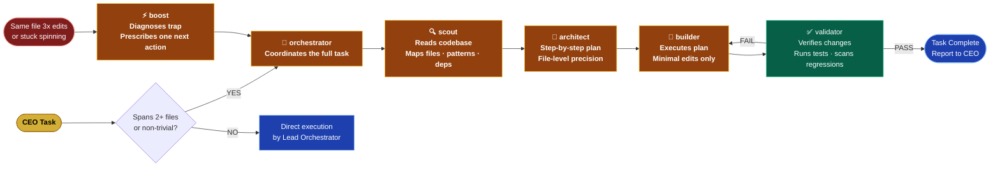
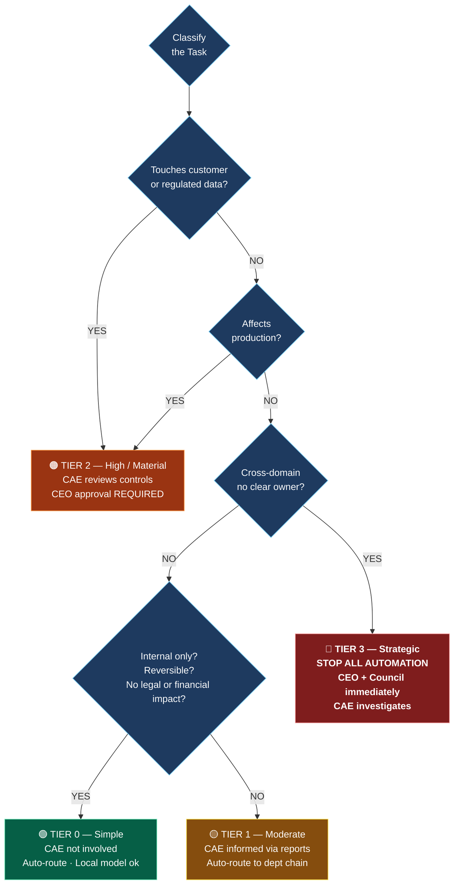
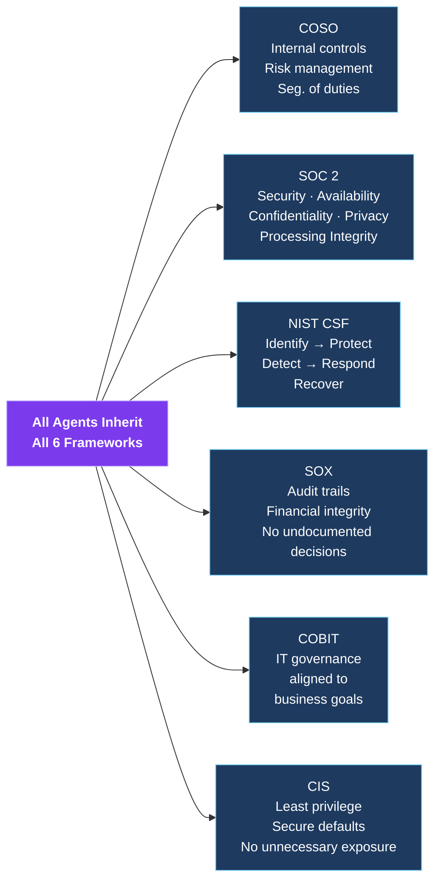
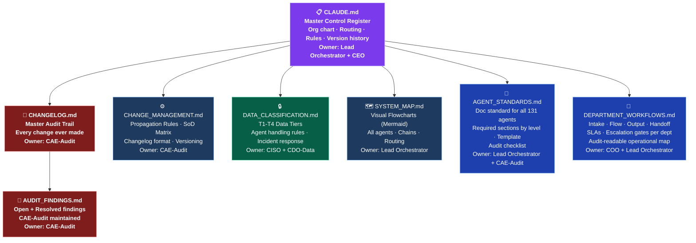

# AI OS — System Map & Visual Flowchart
**Version:** 1.11.0 | **Owner:** Lead Orchestrator | **Auto-Update Required:** YES
**Governed by:** COSO · SOC 2 · NIST CSF · SOX · COBIT · CIS

> **LIVING DOCUMENT.** Every structural change to CLAUDE.md MUST also update this file.
> The Five-File Rule applies: agent file → parent → CLAUDE.md → CHANGELOG.md → SYSTEM_MAP.md.
> Render with: VS Code + "Markdown Preview Mermaid Support" extension → `Ctrl+Shift+V`
>
> **Navigation:** `INDEX.md` — fast lookup & routing quick reference | `CLAUDE.md` — master policy register | `ORG_CHARTS.md` — detailed department org charts

---

## 1. Full Family Tree — Every Agent in the System

```mermaid
graph TD
    classDef ceo fill:#d4af37,stroke:#996515,color:#000,font-weight:bold
    classDef lo fill:#7c3aed,stroke:#c4b5fd,color:#fff,font-weight:bold
    classDef council fill:#065f46,stroke:#6ee7b7,color:#fff
    classDef coo fill:#1e3a5f,stroke:#93c5fd,color:#fff,font-weight:bold
    classDef csuite fill:#1e40af,stroke:#93c5fd,color:#fff,font-weight:bold
    classDef vp fill:#1d4ed8,stroke:#bfdbfe,color:#fff
    classDef principal fill:#1e3a5f,stroke:#7dd3fc,color:#fff
    classDef director fill:#0369a1,stroke:#bae6fd,color:#fff
    classDef manager fill:#0284c7,stroke:#e0f2fe,color:#fff
    classDef senior fill:#0ea5e9,stroke:#f0f9ff,color:#000
    classDef ic fill:#bae6fd,stroke:#0284c7,color:#000
    classDef tech fill:#92400e,stroke:#fbbf24,color:#fff,font-weight:bold
    classDef audit fill:#7f1d1d,stroke:#fca5a5,color:#fff,font-weight:bold
    classDef gaming fill:#14532d,stroke:#86efac,color:#fff,font-weight:bold

    CEO["👤 CEO\nFinal Authority"]:::ceo
    LO["🧠 Lead Orchestrator\nClaude"]:::lo

    CEO --> LO

    AIC["⚡ AI & Automation Council\nCAIO · CISO · CDO · GC · CAE · CPO · CRO"]:::council
    GRC["🛡️ GRC Council\nGC · CISO · CCO · CFO · CAE"]:::council

    LO --> AIC
    LO --> GRC

    %% ── TECHNICAL PIPELINE ───────────────────────────────────
    subgraph TP["⚙️ Technical Pipeline"]
        direction LR
        ORC["orchestrator"]:::tech
        SCO["scout"]:::tech
        ARC["architect"]:::tech
        BLD["builder"]:::tech
        VAL["validator"]:::tech
        BST["boost"]:::tech
        ORC --> SCO --> ARC --> BLD --> VAL
    end
    LO --> TP

    %% ── OPERATIONS HUB ───────────────────────────────────────
    COO["🏢 COO\nOperations Hub"]:::coo
    LO --> COO

    %% ── SECURITY ─────────────────────────────────────────────
    subgraph SEC["🔐 Security"]
        direction TB
        CISO["CISO"]:::csuite
        VPSEC["VP of Security"]:::vp
        PSA["Principal Security Architect"]:::principal
        DIRSEC["Director of Security"]:::director
        SECMGR["Security Manager"]:::manager
        SRSE["Sr Security Engineer"]:::senior
        SECE["Security Engineer"]:::ic
        SECA["Security Associate"]:::ic
        SOCA["Security Analyst"]:::ic
        CISO --> VPSEC --> PSA --> DIRSEC --> SECMGR --> SRSE --> SECE --> SECA --> SOCA
    end
    COO --> CISO

    %% ── ENGINEERING ──────────────────────────────────────────
    subgraph ENG["💻 Engineering"]
        direction TB
        CTO["CTO-Engineering"]:::csuite
        VPENG["VP of Engineering"]:::vp
        PE["Principal Engineer"]:::principal
        DIRENG["Director of Engineering"]:::director
        ENGMGR["Engineering Manager"]:::manager
        SRENG["Sr Software Engineer"]:::senior
        SWE["Software Engineer"]:::ic
        ASO["Associate Engineer"]:::ic
        CTO --> VPENG --> PE --> DIRENG --> ENGMGR --> SRENG --> SWE --> ASO
    end
    COO --> CTO

    %% ── PRODUCT ──────────────────────────────────────────────
    subgraph PROD["📦 Product"]
        direction TB
        CPO["CPO"]:::csuite
        VPPROD["VP of Product"]:::vp
        PPM["Principal Product Manager"]:::principal
        DIRPROD["Director of Product"]:::director
        SRPM["Sr Product Manager"]:::manager
        PM["Product Manager"]:::senior
        PRAN["Product Analyst"]:::ic
        CPO --> VPPROD --> PPM --> DIRPROD --> SRPM --> PM --> PRAN
    end
    COO --> CPO

    %% ── FINANCE ──────────────────────────────────────────────
    subgraph FIN["💰 Finance"]
        direction TB
        CFO["CFO"]:::csuite
        VPFIN["VP of Finance"]:::vp
        PFA["Principal Financial Analyst"]:::principal
        DIRFIN["Director of Finance"]:::director
        DIRFPA["Director of FP&A"]:::director
        DIRTRSY["Director of Treasury"]:::director
        FINMGR["Finance Manager"]:::manager
        FINCTRL["Financial Controller"]:::manager
        SRFA["Sr Financial Analyst"]:::senior
        FA["Financial Analyst"]:::ic
        FINA["Finance Associate"]:::ic
        CFO --> VPFIN --> PFA --> DIRFIN --> FINMGR --> SRFA --> FA --> FINA
        VPFIN --> DIRFPA --> SRFA
        VPFIN --> DIRTRSY --> FINCTRL
    end
    COO --> CFO

    %% ── LEGAL / GRC ──────────────────────────────────────────
    subgraph LEG["⚖️ Legal / GRC"]
        direction TB
        GC["GC-Legal"]:::csuite
        CCO_C["Chief Compliance Officer"]:::vp
        VPLR["VP of Legal & Risk"]:::vp
        PCA["Principal Compliance Architect"]:::principal
        DIRCOM["Director of Compliance"]:::director
        COMMGR["Compliance Manager"]:::manager
        RISKA["Risk Analyst"]:::senior
        COMA["Compliance Analyst"]:::ic
        GC --> CCO_C --> VPLR --> PCA --> DIRCOM --> COMMGR --> RISKA --> COMA
    end
    COO --> GC

    %% ── GTM / REVENUE ────────────────────────────────────────
    subgraph GTM["🚀 GTM / Revenue"]
        direction TB
        CRO["CRO-GTM"]:::csuite
        VPSAL["VP of Sales"]:::vp
        VPMKT["VP of Marketing"]:::vp
        RSD["Regional Sales Director"]:::director
        SA_GTM["Solutions Architect"]:::manager
        FDE["Forward Deployed Engineer"]:::manager
        AE["Account Executive"]:::senior
        CSM_A["Customer Success Manager"]:::senior
        SDR["SDR"]:::ic
        BDR["BDR"]:::ic
        MM["Marketing Manager"]:::director
        CONT["Content Strategist"]:::senior
        GROW["Growth Analyst"]:::ic
        CRO --> VPSAL --> RSD --> SA_GTM --> FDE --> AE --> CSM_A --> SDR
        CSM_A --> BDR
        CRO --> VPMKT --> MM --> CONT --> GROW
    end
    COO --> CRO

    %% ── INVESTMENTS ──────────────────────────────────────────
    subgraph INV["📈 Investments"]
        direction TB
        CIO["CIO-Investments"]:::csuite
        VPINV["VP of Investments"]:::vp
        PORT["Portfolio Manager"]:::manager
        SRQA["Sr Quant Analyst"]:::senior
        QA_I["Quant Analyst"]:::ic
        INVA["Investment Analyst"]:::ic
        DIRRI["Director of Research"]:::director
        SREAR["Sr Equity Research Analyst"]:::senior
        EAR["Equity Research Analyst"]:::ic
        RAI["Research Associate"]:::ic
        RSKM["Risk Manager"]:::manager
        SRRA["Sr Risk Analyst"]:::senior
        RA_I2["Risk Analyst"]:::ic
        CIO --> VPINV --> PORT --> SRQA --> QA_I --> INVA
        VPINV --> DIRRI --> SREAR --> EAR --> RAI
        VPINV --> RSKM --> SRRA --> RA_I2
    end
    COO --> CIO

    %% ── DATA & ANALYTICS ─────────────────────────────────────
    subgraph DAT["🗄️ Data & Analytics"]
        direction TB
        CDO["CDO-Data"]:::csuite
        VPDAT["VP of Data"]:::vp
        PDA["Principal Data Architect"]:::principal
        DIRDE["Director of Data Engineering"]:::director
        SRDE["Sr Data Engineer"]:::senior
        DIRAN["Director of Analytics"]:::director
        SRDA["Sr Data Analyst"]:::senior
        DAA["Data Analyst"]:::ic
        DSC["Data Scientist"]:::senior
        CDO --> VPDAT --> PDA --> DIRDE --> SRDE
        VPDAT --> DIRAN --> SRDA --> DAA
        VPDAT --> DSC
    end
    COO --> CDO

    %% ── DEVOPS / PLATFORM ────────────────────────────────────
    subgraph DEV["⚙️ DevOps / Platform"]
        direction TB
        CPLATO["CPlatO-DevOps"]:::csuite
        VPPE["VP of Platform Engineering"]:::vp
        PPA["Principal Platform Architect"]:::principal
        DIRCI["Director of Cloud Infrastructure"]:::director
        SRDOE["Sr DevOps Engineer"]:::senior
        DOES["DevOps Engineer"]:::ic
        DIRSRE["Director of SRE"]:::director
        SREE["SRE Engineer"]:::ic
        DIRBOPS["Dir-BrowserOps\nPlaywright MCP · Domain Allowlist"]:::director
        DIRMCH["Dir-MCPHub\nMetaMCP · Tool ACLs · Namespaces"]:::director
        CPLATO --> VPPE --> PPA --> DIRCI --> SRDOE --> DOES
        VPPE --> DIRSRE --> SREE
        VPPE --> DIRBOPS
        VPPE --> DIRMCH
    end
    COO --> CPLATO

    %% ── AI & ML ──────────────────────────────────────────────
    subgraph AIM["🤖 AI & ML"]
        direction TB
        CAIO["CAIO-AI"]:::csuite
        VPAIE["VP of AI Engineering"]:::vp
        DIRML["Director of ML Engineering"]:::director
        DIRMLO["Director of MLOps"]:::director
        SRML["Sr ML Engineer"]:::senior
        MLE["ML Engineer"]:::ic
        MLO["MLOps Engineer"]:::ic
        DIRAIR["Director of AI Research"]:::director
        CAIO --> VPAIE --> DIRML --> SRML --> MLE
        VPAIE --> DIRMLO --> MLO
        VPAIE --> DIRAIR
    end
    COO --> CAIO

    %% ── CX & DESIGN ──────────────────────────────────────────
    subgraph DES["🎨 CX & Design"]
        direction TB
        CCO_D["CCO-Design"]:::csuite
        VPCX["VP of Customer Experience"]:::vp
        DIRUX["Director of UX Design"]:::director
        SRUXD["Sr UX Designer"]:::senior
        UXDG["UX Designer"]:::ic
        DIRUR["Director of User Research"]:::director
        UXRES["UX Researcher"]:::ic
        DIRCS["Director of Customer Support"]:::director
        CSS["Customer Support Specialist"]:::ic
        CCO_D --> VPCX --> DIRUX --> SRUXD --> UXDG
        VPCX --> DIRUR --> UXRES
        VPCX --> DIRCS --> CSS
    end
    COO --> CCO_D

    %% ── STRATEGY ─────────────────────────────────────────────
    subgraph STR["🔭 Strategy"]
        direction TB
        CSO["CSO-Strategy"]:::csuite
        VPSTR["VP of Strategy"]:::vp
        DIRCS2["Director of Corporate Strategy"]:::director
        DIRCI2["Director of Competitive Intelligence"]:::director
        DIRMR["Director of Market Research"]:::director
        CSO --> VPSTR --> DIRCS2
        VPSTR --> DIRCI2
        VPSTR --> DIRMR
    end
    COO --> CSO

    %% ── RESEARCH & INNOVATION ────────────────────────────────
    subgraph RES["🔬 Research & Innovation"]
        direction TB
        CIRO["CIRO-Research"]:::csuite
        VPRES["VP of Research"]:::vp
        PR["Principal Researcher"]:::principal
        DIRTR["Director of Tech Research"]:::director
        SRTR["Sr Tech Researcher"]:::senior
        DIRMR2["Director of Market Research"]:::director
        DIRSR["Director of Scientific Research"]:::director
        RSCI["Research Scientist"]:::senior
        DIRAR["Director of AI Research"]:::director
        HIL["Head of Innovation Lab"]:::director
        IE["Innovation Engineer"]:::senior
        RA_R["Research Associate"]:::ic
        CIRO --> VPRES --> PR --> DIRTR --> SRTR --> RA_R
        PR --> DIRMR2 --> RA_R
        PR --> DIRSR --> RSCI --> RA_R
        PR --> DIRAR --> RA_R
        VPRES --> HIL --> IE
    end
    COO --> CIRO

    %% ── PROMPT ENGINEERING ───────────────────────────────────
    subgraph PRM["✍️ Prompt Engineering"]
        direction TB
        CPRO["CPrO-Prompting"]:::csuite
        VPPE2["VP of Prompt Engineering"]:::vp
        PPE["Principal Prompt Engineer"]:::principal
        DIRPR["Director of Prompt Research"]:::director
        DIRPO["Director of Prompt Ops"]:::director
        DIRPQ["Director of Prompt QA"]:::director
        PRMGR["Prompt Engineering Manager"]:::manager
        SRPE["Sr Prompt Engineer"]:::senior
        PRENG["Prompt Engineer"]:::ic
        AIS["AI Integration Specialist"]:::ic
        UPO["User Prompt Optimizer"]:::ic
        CPRO --> VPPE2 --> PPE --> DIRPR
        PPE --> DIRPO
        PPE --> DIRPQ --> PRMGR --> SRPE --> PRENG --> AIS --> UPO
    end
    COO --> CPRO

    %% ── INTERNAL AUDIT (INDEPENDENT) ─────────────────────────
    subgraph AUD["🔍 Internal Audit"]
        direction TB
        CAE["CAE-Audit"]:::audit
        DIRIA["Director of Internal Audit"]:::audit
        SAM["Sr Audit Manager"]:::audit
        AM["Audit Manager"]:::audit
        SRAUD["Sr Auditor"]:::audit
        AUDR["Auditor"]:::audit
        AUDA["Audit Associate"]:::audit
        CAE --> DIRIA --> SAM --> AM --> SRAUD --> AUDR --> AUDA
    end
    COO --> CAE
    CAE -->|"Reports independently"| CEO

    %% ── GAMING INTELLIGENCE ──────────────────────────────
    subgraph GAM["🎮 Gaming Intelligence"]
        direction TB
        DIRGAM["Dir-Gaming\nDept Head · Skill Integration\nKiriko intent router"]:::gaming
        PATCH["Patch-Analyst\nPatch notes · Update cards\nHaiku-class"]:::senior
        COACH["Meta-Coach\nTier lists · Coaching · Loadouts\nSonnet-class"]:::senior
        GRES["Game-Researcher\nMechanics · Esports · Lore\nHaiku-class"]:::ic
        DIRGAM --> PATCH
        DIRGAM --> COACH
        DIRGAM --> GRES
    end
    LO --> DIRGAM

    %% ── CHIEF OF STAFF (AUTONOMOUS COORDINATOR) ──────────
    COS["🗂️ Chief-of-Staff\nCEO proxy · Company rhythm\nAutonomous decision authority"]:::coo
    LO --> COS
    COS --> COO

    %% ── HR / PEOPLE ──────────────────────────────────────
    subgraph HRP["👥 HR / People"]
        direction TB
        CHRO["CHRO"]:::csuite
        VPPPL["VP of People"]:::vp
        DIRTA["Director of Talent Acquisition"]:::director
        DIRHRBP["Director of HR Business Partners"]:::director
        DIRTR2["Director of Total Rewards"]:::director
        SREC["Sr Recruiter"]:::senior
        HRBP["HR Business Partner"]:::ic
        CHRO --> VPPPL --> DIRTA --> SREC
        VPPPL --> DIRHRBP --> HRBP
        VPPPL --> DIRTR2
    end
    COO --> CHRO

    %% ── COMMUNICATIONS ───────────────────────────────────
    subgraph COM["📣 Communications"]
        direction TB
        VPCOM["VP of Communications"]:::vp
        DIRPR["Director of PR"]:::director
        DIRI["Director of Internal Comms"]:::director
        COMSP["Communications Specialist"]:::ic
        VPCOM --> DIRPR --> COMSP
        VPCOM --> DIRI --> COMSP
    end
    COO --> VPCOM

    %% ── PMO / PROGRAMS ───────────────────────────────────
    subgraph PMO["📋 PMO"]
        direction TB
        VPPMO["VP of PMO"]:::vp
        SRPGM["Sr Program Manager"]:::senior
        PGM["Program Manager"]:::ic
        VPPMO --> SRPGM --> PGM
    end
    COS --> VPPMO
```

---

## 2. Technical Execution Pipeline

---

## 3. Routing Decision Tree

```mermaid
flowchart TD
    classDef input fill:#d4af37,stroke:#996515,color:#000,font-weight:bold
    classDef route fill:#1e40af,stroke:#93c5fd,color:#fff
    classDef gate fill:#065f46,stroke:#6ee7b7,color:#fff
    classDef stop fill:#7f1d1d,stroke:#fca5a5,color:#fff
    classDef local fill:#4a1942,stroke:#d8b4fe,color:#fff
    classDef decision fill:#1e3a5f,stroke:#7dd3fc,color:#fff

    IN(["CEO Input"]):::input --> KW{"Keyword\nClassification"}:::decision

    KW -->|"build · implement · refactor · deploy"| FEAT["FEATURE / CODE\nCPO → CTO → CISO"]:::route
    KW -->|"research · analysis · benchmark"| RES["RESEARCH\nCIRO → relevant dept"]:::route
    KW -->|"vulnerability · breach · SOC2 · GDPR"| SEC["SECURITY / COMPLIANCE\nCISO or GC-Legal"]:::route
    KW -->|"GTM · launch · pricing · positioning"| GTM_R["GTM / STRATEGY\nCPO + CRO-GTM → CFO"]:::route
    KW -->|"portfolio · stock · equity · treasury"| INV_R["INVESTMENTS\nCIO-Investments → CFO"]:::route
    KW -->|"data model · warehouse · ETL · dashboard"| DAT_R["DATA / ANALYTICS\nCDO-Data → CISO"]:::route
    KW -->|"Kubernetes · VPC · CI/CD · Terraform"| DEV_R["INFRA / DEVOPS\nCPlatO-DevOps → CISO"]:::route
    KW -->|"browser · playwright · MCP hub · vision agent · screenshot"| BRW_R["BROWSER / MCP\nDir-BrowserOps or Dir-MCPHub"]:::route
    KW -->|"LLM · agent · RAG · fine-tune"| AI_R["AI / ML\nCAIO-AI → AI Council"]:::route
    KW -->|"prompt · system prompt · guardrail"| PRM_R["PROMPT ENGINEERING\nCPrO → Dir-PromptQA"]:::route
    KW -->|"UX · UI · design · NPS · CSAT"| UX_R["UX / DESIGN / CX\nCCO-Design → CPO"]:::route
    KW -->|"patch · nerf · buff · meta · tier list · loadout · esports · ranked"| GAM_R["GAMING\nDir-Gaming → Patch-Analyst\nor Meta-Coach or Game-Researcher"]:::route
    KW -->|"hiring · recruiting · people ops · culture · onboarding · performance"| HR_R["HR / PEOPLE\nCHRO → VP-People"]:::route
    KW -->|"PR · press release · internal comms · announcement · brand messaging"| COM_R["COMMUNICATIONS\nVP-Communications → Dir-PR or Dir-Internal-Comms"]:::route
    KW -->|"program management · cross-dept coordination · initiative tracking"| PMO_R["PMO\nChief-of-Staff → VP-PMO"]:::route
    KW -->|"format · summarize · classify · draft"| T0["TIER 0 — SIMPLE\nLocal-Model-Router\nOllama saves tokens"]:::local
    KW -->|unclear| Q{"One clarifying\nquestion"}:::decision
    Q -->|still unclear| STOP(["STOP\nEscalate to CEO"]):::stop

    FEAT --> TIER{"Risk Tier?"}:::decision
    TIER -->|"0-1  internal · reversible"| AUTO["Auto-route to dept chain"]:::gate
    TIER -->|"2  customer-facing · prod"| CEO_A(["PAUSE\nCEO approval required"]):::stop
    TIER -->|"3  cross-domain · existential"| STOP2(["STOP ALL AUTOMATION\nCEO + Council now"]):::stop
```

---

## 4. Risk Tier Classification

---

## 5. Governance & Compliance

---

## 5b. Documentation Layer — Governance Files

---

## 6. Versioning Convention

---

## Update Log

| Version | Date | Change |
|---------|------|--------|
| 1.7.0 | 2026-03-19 | Initial creation. 8 diagrams covering authority, pipeline, routing, risk tiers, dept overview, all 14 dept chains, versioning, compliance. |
| 1.8.0 | 2026-03-19 | Full rebuild. Added color-coded classDef styling to all diagrams. Replaced individual dept chain diagrams with unified Family Tree (all 100+ agents in one graph). Improved node shapes, edge labels, and layout. |
| 1.8.1 | 2026-03-19 | Governance doc layer expanded. AGENT_STANDARDS.md and DEPARTMENT_WORKFLOWS.md added to Documentation Layer diagram. ~42 thin agents upgraded across Security, Finance, Legal, Compliance, Audit, Product, GTM, Investments, Data, Strategy, and Design departments. |
| 1.10.0 | 2026-03-25 | Gaming Intelligence department added. Dir-Gaming + Patch-Analyst + Meta-Coach + Game-Researcher added to Family Tree. Gaming domain added to Routing Decision Tree. |
